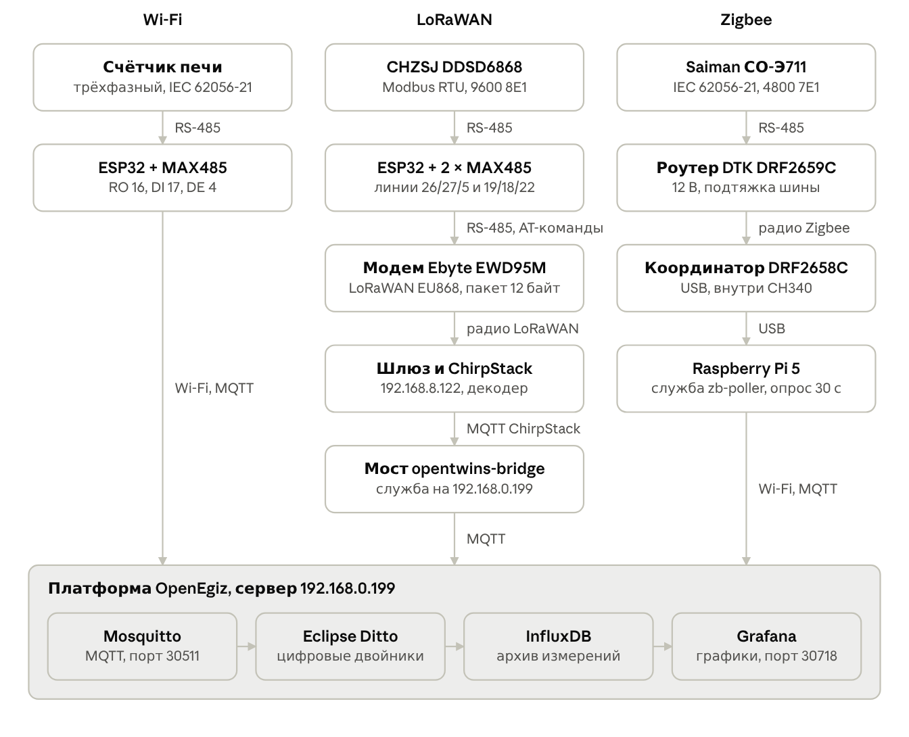

<h1 align="center">Счётчики электроэнергии → цифровой двойник</h1>

<p align="center">
Три канала съёма показаний — <b>Wi-Fi</b>, <b>LoRaWAN</b> и <b>Zigbee</b> — для платформы цифровых двойников <b>OpenEgiz</b><br>
Лаборатория цифровых двойников КазНУ им. аль-Фараби · сентябрь 2026
</p>

<p align="center">


</p>

<p align="center">
  
</p>

Здесь лежит всё, что нужно, чтобы повторить стенд с нуля: прошивки ESP32, декодер для ChirpStack, мост в платформу, программа опроса Zigbee-счётчика, диагностические скетчи, дашборды Grafana, инструкция для новичков и отчёт о работе.

> **Начни с инструкции:** [docs/instruction.md](docs/instruction.md). Она читается за 15 минут и объясняет, что куда подключено и где мы ошибались. Есть версии в [PDF](docs/Инструкция%20-%20счетчики%20в%20цифровом%20двойнике.pdf) и [Word](docs/Инструкция%20-%20счетчики%20в%20цифровом%20двойнике.docx).

---

## Каналы

| Канал | Счётчик | Протокол счётчика | Как данные попадают на сервер | Папка |
|---|---|---|---|---|
| **LoRaWAN** | CHZSJ DDSD6868, однофазный | Modbus RTU, 9600 8E1 | ESP32 → модем Ebyte EWD95M → шлюз → ChirpStack → мост → OpenEgiz | [`lorawan/`](lorawan) |
| **Zigbee** | Saiman «Орман» СО-Э711, однофазный | IEC 62056-21, 4800 7E1 | Роутер DTK → координатор DTK → Raspberry Pi → OpenEgiz | [`zigbee/`](zigbee) |
| **Wi-Fi** | Дала СА4-Э720, трёхфазный (печь) | IEC 62056-21, 4800 7E1 | ESP32 → Wi-Fi → OpenEgiz | [`wifi-oven/`](wifi-oven) |

Все три канала заканчиваются одинаково: сообщением MQTT с единым набором полей. Поэтому новый счётчик подключается к платформе без изменений на сервере.

## С чего начать

1. Прочитай [инструкцию](docs/instruction.md) — хотя бы разделы «Что мы сделали» и «Ошибки, которые останавливали работу».
2. Выбери канал и открой его папку: там схема подключения, прошивка и пошаговый запуск.
3. Перед подключением **прозвони каждый модуль MAX485** и проверь выводы ESP32 скетчем [`esp32-pin-check2`](diagnostics). Неисправный модуль у нас сжёг две ножки и целую плату.
4. Создай цифровой двойник в Grafana → OpenTwins → Twins (кнопка Copy у работающего) и только потом включай отправку данных. Без двойника платформа молча выбрасывает сообщения.
5. Если данные не идут — раздел [«Если данные перестали приходить»](docs/instruction.md#если-данные-перестали-приходить).

## Формат сообщения платформы

Топик `opentwins/<пространство>:<имя>`, тело в JSON:

```json
{
  "device_id": "lower_lab:lorawan-meter",
  "data": {
    "voltage_a_v": 213.8,
    "current_a_a": 0.0,
    "active_power_w": 0,
    "power_factor_total": 1.0,
    "active_energy_positive_kwh": 0.54
  }
}
```

Два условия, без которых данные пропадают без всякой ошибки:

- `device_id` записан как `пространство:имя`, через двоеточие;
- двойник с таким идентификатором уже создан на платформе.

## Структура репозитория

```text
energy-meters-digital-twin/
├── docs/
│   ├── instruction.md              инструкция для новичков (с фото)
│   ├── Инструкция - ... .pdf/.docx   она же в PDF и Word
│   ├── reports/                    отчёты: итоговый по ГОСТ 7.32-2017 и прежние
│   ├── guides/                     настройка EWD95M и монтаж счётчика (HTML)
│   └── images/                     фото и схемы
├── lorawan/
│   ├── firmware/                   прошивка ESP32 esp32-meter-lorawan-v7
│   ├── chirpstack/                 декодер пакета для ChirpStack
│   ├── bridge/                     мост ChirpStack → OpenEgiz + служба systemd
│   └── tools/                      поиск регистров Modbus счётчика
├── zigbee/
│   ├── zb_poller.py                опрос счётчика Saiman и отправка в OpenEgiz
│   ├── zb-poller.service           служба systemd для Raspberry Pi
│   └── tools/                      разведка протокола, проверка радиоканала
├── wifi-oven/
│   └── firmware/                   прошивка ESP32 счётчика печи
├── diagnostics/                    скетчи ESP32 для поиска неисправностей
└── platform/
    ├── grafana/                    дашборды для импорта
    └── ditto/                      шаблон цифрового двойника
```

## Главные грабли

Всё это уже стоило нам часов или дней. Подробности и фото — в [инструкции](docs/instruction.md#ошибки-которые-останавливали-работу).

| Что случилось | Как проявлялось | Как не повторить |
|---|---|---|
| DE удерживался 2500 мкс после отправки | Модем «отвечал мусором» `6A AA 48 F8`, три дня искали поломку | Отпускать DE не позже 100 мкс после `flush()` |
| Неисправный MAX485 | Отказали GPIO 23 и 25, потом вся плата ESP32 | Прозванивать модули до подключения; мерить A–B при передаче |
| Счётчик и модем на одной шине | Счётчик переставал отвечать | Каждому устройству свой MAX485 и свой UART |
| Нет подтяжки RS-485 | Zigbee-роутер признали неисправным, канал простоял три недели | Резисторы 4,7 кОм / 470 Ом / 4,7 кОм на клеммах роутера |
| Неверный `device_id` или ID двойника | Устройство шлёт данные, Grafana стоит | Подписаться на `opentwins/#` и дождаться `twin/events` |
| Zigbee через бетонные перекрытия | Нет связи между подвалом и вторым этажом | Координатор на одном этаже с роутером |

## Адреса стенда

Это внутренние адреса лаборатории; в другой сети их нужно заменить в настройках скриптов.

| Сервис | Адрес |
|---|---|
| MQTT платформы OpenEgiz | `192.168.0.199:30511` |
| Grafana (с интерфейсом OpenTwins) | `http://192.168.0.199:30718` |
| Eclipse Ditto API | `http://192.168.0.199:30525` |
| ChirpStack | `http://192.168.8.122:8080`, MQTT `192.168.8.122:1883` |
| Базовая станция LoRaWAN | `0016c001f17a6c24`, EU868 |

## Документы

| Документ | Что внутри |
|---|---|
| [Инструкция для студентов](docs/instruction.md) | Как устроен стенд, пошаговое подключение, ошибки, диагностика |
| [Отчёт о выполненной работе, сентябрь 2026](docs/reports) | 37 страниц по ГОСТ 7.32-2017: все каналы, отказы, данные за неделю, рекомендации |
| [Руководство по EWD95M и LoRaWAN](docs/guides/EWD95M_DDSD6868_LoRaWAN_руководство.html) | Настройка модема, регистрация в сетевом сервере, декодер |
| [Монтаж счётчика DDSD6868](docs/guides/Монтаж_счетчика_DDSD6868.html) | Установка счётчика и прокладка кабеля |

HTML-руководства удобнее открывать после скачивания репозитория: GitHub показывает их исходным кодом.

## Безопасность

- Пароли Wi-Fi и MQTT в репозиторий не попадают: прошивка печи читает их из `secrets.h`, а в Git лежит только шаблон `secrets.example.h`.
- Заводской пароль счётчика Saiman задаётся переменной окружения `METER_PASSWORD`.
- Логины к Grafana, ChirpStack, InfluxDB и Ditto выдаёт руководитель лаборатории. Заводские пароли на этих сервисах стоит сменить.
