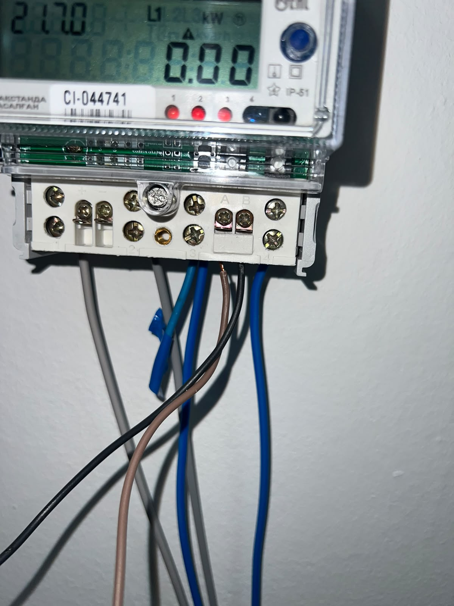
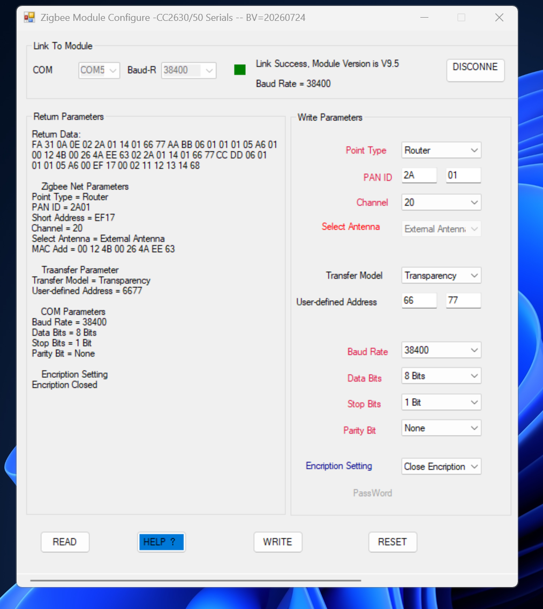
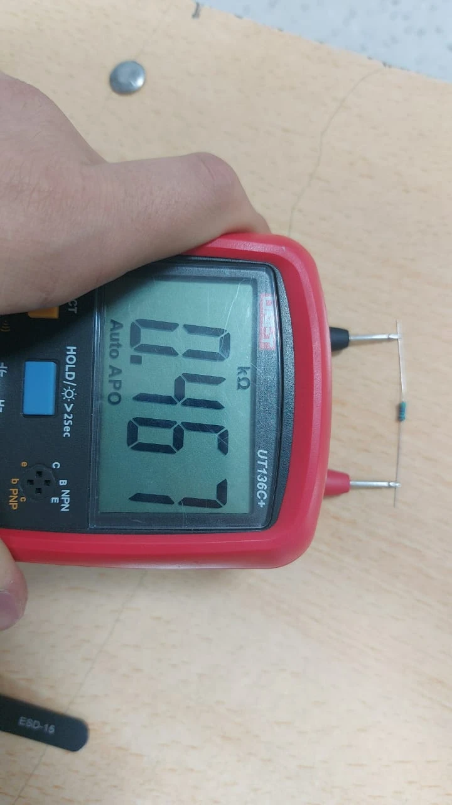
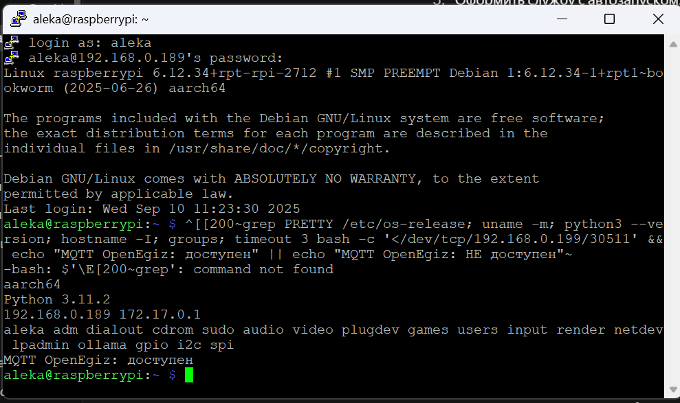
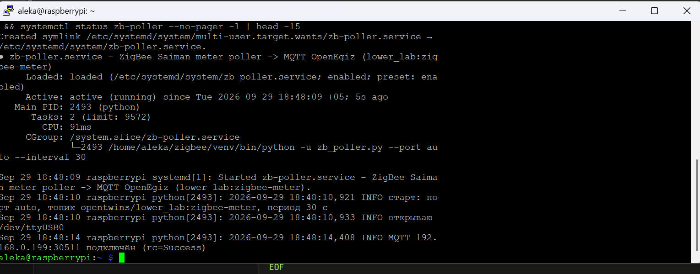
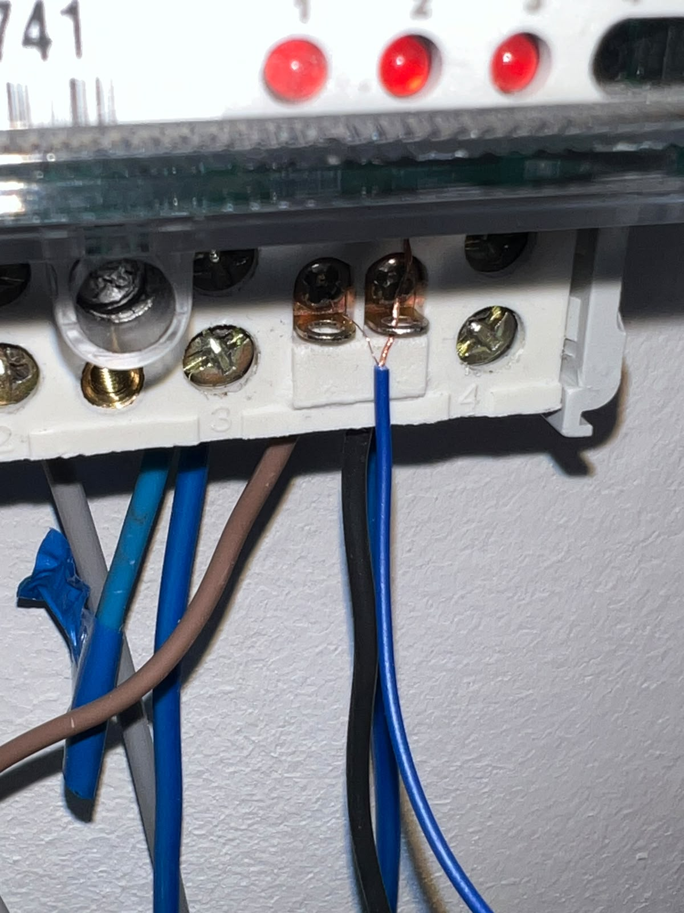
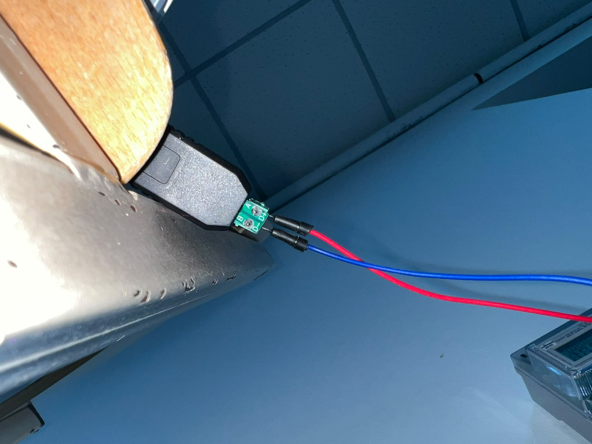

# Счётчики электроэнергии в цифровом двойнике

**Понятная инструкция для студентов** · Лаборатория цифровых двойников КазНУ им. аль-Фараби · 30 сентября 2026 г.

> Та же инструкция в [Word](Инструкция%20-%20счетчики%20в%20цифровом%20двойнике.docx) и [PDF](Инструкция%20-%20счетчики%20в%20цифровом%20двойнике.pdf).

## Содержание

- [Что мы сделали](#что-мы-сделали)
- [Что понадобится](#что-понадобится)
- [Шаг 1. Счётчик и линия RS-485](#шаг-1-счётчик-и-линия-rs-485)
- [Шаг 2. Радиоканал LoRaWAN](#шаг-2-радиоканал-lorawan)
- [Шаг 3. Из ChirpStack в цифровой двойник и Grafana](#шаг-3-из-chirpstack-в-цифровой-двойник-и-grafana)
- [Канал Zigbee и Wi-Fi-счётчик печи](#канал-zigbee-и-wi-fi-счётчик-печи)
- [Ошибки, которые останавливали работу](#ошибки-которые-останавливали-работу)
- [Если данные перестали приходить](#если-данные-перестали-приходить)

## Что мы сделали

Мы подключили три счётчика электроэнергии к цифровым двойникам лаборатории по трём разным каналам: Wi-Fi, LoRaWAN и Zigbee. Каждый счётчик раз в 30–40 секунд отдаёт напряжение, ток, мощность, коэффициент мощности и энергию, а платформа OpenEgiz хранит их и рисует графики в Grafana.

<p align="center"></p>

<p align="center"><em>Три счётчика, три канала, одна платформа OpenEgiz: путь данных от клемм счётчика до графика в Grafana</em></p>

Каналы отличаются только тем, как данные добираются до сервера. В платформу все три приходят одинаковым сообщением MQTT с одними и теми же именами полей, поэтому четвёртый счётчик подключается без изменений на сервере.

Подробнее всего описан канал LoRaWAN (шаги 1–3): он самый сложный и на нём мы потеряли больше всего времени. Zigbee и Wi-Fi идут отдельным разделом.

## Что понадобится

Для одного канала нужны счётчик, преобразователь RS-485, радиомодуль и сервер, который уже развёрнут в лаборатории. Ниже всё, что стоит на стенде сейчас.

| Канал | Узел | Что стоит | На что обратить внимание |
|---|---|---|---|
| LoRaWAN | Счётчик | CHZSJ DDSD6868, однофазный | Modbus RTU, 9600 бод, 8E1, адрес 1 |
| LoRaWAN | Контроллер | ESP32 DevKit на модуле ESP-WROOM-32 | Не путать с ESP8266 (NodeMCU): у того один UART, двух линий RS-485 он не потянет |
| LoRaWAN | Преобразователи | Два модуля MAX485 | Один на счётчик, второй на модем. Общую шину не делать |
| LoRaWAN | Модем | Ebyte EWD95M | Питание 5–28 В, RS-485 9600 бод 8N1 |
| LoRaWAN | Сеть | Шлюз `0016c001f17a6c24`, ChirpStack на 192.168.8.122 | Другая подсеть, не 192.168.0.x |
| Zigbee | Счётчик | Saiman «Орман» СО-Э711, код CI | IEC 62056-21, 4800 бод, 7E1 |
| Zigbee | Радиомост | DTK DRF2659C (роутер) и DRF2658C (координатор, USB) | Роутеру нужно 12 В, от 5 В он не передаёт |
| Zigbee | Опросчик | Raspberry Pi 5 | Служба `zb-poller`, опрос раз в 30 с |
| Zigbee | Подтяжка шины | Резисторы 4,7 кОм × 2 и 470 Ом | Без них шина молчит |
| Все | Платформа | OpenEgiz на 192.168.0.199 | MQTT 30511, Grafana 30718 |
| Все | Инструмент | Мультиметр с режимами V и Ω | Главный инструмент диагностики |
| Все | Программы | Arduino IDE 2 с пакетом esp32, Python 3 (pyserial, paho-mqtt), PuTTY, утилита DTK | Утилита DTK нужна только для настройки роутера |

Логины и пароли к серверам выдаёт руководитель лаборатории. В инструкцию они не внесены намеренно.

## Шаг 1. Счётчик и линия RS-485

ESP32 сам по себе не умеет разговаривать по RS-485, для этого между ним и счётчиком ставится модуль MAX485. На стенде таких модулей два, и у каждого своя линия: один смотрит на счётчик, другой на модем.

| Линия | RO (приём) | DI (передача) | DE и RE вместе | Формат |
|---|---|---|---|---|
| Счётчик DDSD6868 | GPIO 26 | GPIO 27 | GPIO 5 | 9600 бод, 8E1 |
| Модем EWD95M | GPIO 19 | GPIO 18 | GPIO 22 | 9600 бод, 8N1 |

<p align="center"></p>

<p align="center"><em>У каждого устройства свой MAX485 и свои три провода к ESP32. Стрелка показывает направление сигнала</em></p>

VCC обоих модулей идёт на 3V3 платы, GND на GND. Земля блока питания модема тоже соединяется с GND платы, иначе RS-485 работать не будет.

Порядок сборки:

1. Перед подключением прозвони каждый MAX485: сопротивление между выводом DE и GND у исправного модуля — обрыв или десятки килоом. Десятки ом или писк означают, что модуль сгорит ножку ESP32.
2. Собери линию счётчика по таблице. У DDSD6868 интерфейс RS-485 выведен на клеммы 5 и 6, импульсный выход на 1 и 2 — их не путать.
3. Залей эскиз `esp32-meter-diag` и открой монитор порта на 115200. Счётчик должен ответить строкой `OTVET VERNYY, U=213.0 V`.
4. Тишина — сними питание и поменяй A и B местами. Это безопасно и чаще всего помогает.

Счётчик отдаёт величины из регистров Modbus. Карту мы нашли перебором и сверили с дисплеем:

| Величина | Регистр | Как пересчитать |
|---|---|---|
| Напряжение, В | 0x0000 | × 0,1 |
| Ток, А | 0x0003 | × 0,01 |
| Активная мощность, Вт | 0x0008 | как есть |
| Коэффициент мощности | 0x0013 | × 0,001 |
| Частота, Гц | 0x001A | × 0,01 |
| Энергия, кВт·ч | 0x001D–0x001E | 32 бита, × 0,01 |

Главное правило прошивки: после отправки запроса сразу отпускай DE. Модем отвечает почти мгновенно, и удержание DE дольше 100 мкс срезает начало его ответа. Подробнее в разделе об ошибках.

## Шаг 2. Радиоканал LoRaWAN

Модем EWD95M — готовое устройство LoRaWAN, которое принимает AT-команды по RS-485. ESP32 раз в 40 секунд складывает показания в пакет из 12 байт и отдаёт его модему, а тот передаёт пакет в эфир на шлюз.

Регистрация в ChirpStack (веб-интерфейс `http://192.168.8.122:8080`):

1. Создай профиль устройства: регион EU868, класс A, подключение OTAA.
2. Во вкладку Codec этого профиля вставь декодер из файла `chirpstack_decoder_ddsd6868.js`.
3. Добавь устройство в приложение. DevEUI берётся с самого модема командой `AT+CDEVEUI=?`, у нашего это `0080E115053FE291`. JoinEUI — нули. AppKey в ChirpStack и в модеме должен совпадать байт в байт.
4. Прошей ESP32 эскизом `esp32-meter-lorawan-v7` и смотри журнал. Ключи и регион хранятся в памяти модема, поэтому при замене ESP32 перерегистрировать ничего не нужно.

Так выглядит рабочий журнал ESP32 на скорости 115200:

```text
>>> MODUL NAYDEN na vyvodah 19/18/22
[<] 5:EU868
[*] +EVT:JOINED
U=213.5 V  I=0.00 A  P=0 W  PF=1.000  F=50.00 Hz  E=0.54 kWh
[>] AT+SEND=2:1:0:010857000000006400000036
[<] OK ... +SENT:01
[*] +EVT:RX_1, PORT 0, DR 0, RSSI -100, SNR 5
```

Если первая отправка вернула `AT_PARA`, это нормально: пакет ушёл до завершения присоединения, следующий пройдёт.

Команды модема, которые использует прошивка:

| Команда | Зачем | Ответ у нас |
|---|---|---|
| `AT` | Проверка связи | `OK` |
| `AT+CDEVEUI=?` | Идентификатор модема | `0080E115053FE291` |
| `AT+REGION=?` | Частотный план | `5:EU868` |
| `AT+CADR=1` | Включить адаптивную скорость | `OK` |
| `AT+CJOIN=1:1` | Присоединиться к сети | `OK`, затем `+EVT:JOINED` |
| `AT+SEND=2:1:0:<hex>` | Отправить пакет на порт 2 | `OK`, затем `+SENT` |

Пакет всегда 12 байт, многобайтные числа идут старшим байтом вперёд:

| Байты | Что внутри | Пересчёт |
|---|---|---|
| 0 | Версия формата, всегда 0x01 | — |
| 1–2 | Напряжение | × 0,1 В |
| 3–4 | Ток | × 0,01 А |
| 5–6 | Активная мощность | Вт |
| 7 | Коэффициент мощности | × 0,01 |
| 8–11 | Активная энергия | × 0,01 кВт·ч |

Реальный пример: ChirpStack принял `AQh1AAAAAGQAAAA2` и разобрал его как 216,5 В и 0,54 кВт·ч. В диапазоне EU868 устройство может занимать эфир не больше 1 % времени, поэтому период короче 40 секунд ставить не стоит.

## Шаг 3. Из ChirpStack в цифровой двойник и Grafana

ChirpStack и платформа OpenEgiz живут в разных подсетях и напрямую не общаются. Переносит данные мост — служба `opentwins-bridge` на сервере 192.168.0.199: она слушает MQTT ChirpStack и перекладывает расшифрованные значения в MQTT платформы.

Платформа принимает сообщение только в одном формате. Топик `opentwins/lower_lab:lorawan-meter`, тело:

```text
{"device_id": "lower_lab:lorawan-meter",
 "data": {"voltage_a_v": 213.8, "current_a_a": 0.0, "active_power_w": 0,
          "power_factor_total": 1.0, "active_energy_positive_kwh": 0.54}}
```

Два условия, без которых данные молча пропадают, без всякой ошибки:

- `device_id` записан как `пространство:имя`, с двоеточием. Платформа делит его по двоеточию, и `ESP32_Meter_001` она просто выбросит.
- Двойник с таким ID уже создан в Grafana → OpenTwins → Twins. Сам он не появится.

Имена полей у всех счётчиков одинаковые, поэтому новый двойник проще всего делать кнопкой Copy из уже работающего. Сейчас на платформе три двойника:

| Двойник | Счётчик | Канал | Кто публикует |
|---|---|---|---|
| `lower_lab:lorawan-meter` | CHZSJ DDSD6868 | LoRaWAN | Служба `opentwins-bridge` на сервере |
| `lower_lab:zigbee-meter` | Saiman СО-Э711 | Zigbee | Служба `zb-poller` на Raspberry Pi |
| `lower_lab:oven` | Счётчик печи | Wi-Fi | ESP32 напрямую |

Дальше платформа всё делает сама: Ditto обновляет двойник, Telegraf пишет значения в InfluxDB (bucket `default`, измерение `esp_telemetry`, тег `thingId`), а Grafana рисует графики. Дашборды: `ddsd6868-lorawan` и `saiman-zigbee`.

Обслуживание моста на сервере:

```text
sudo systemctl status opentwins-bridge     # работает ли
sudo systemctl restart opentwins-bridge    # перезапуск
journalctl -u opentwins-bridge -f          # журнал в реальном времени
```

Чтобы подключить ещё один модем LoRaWAN, достаточно дописать строку в словарь `DEVICES` в `chirpstack_to_opentwins.py`: DevEUI модема и ID двойника.

## Канал Zigbee и Wi-Fi-счётчик печи

Счётчик Saiman опрашивается без микроконтроллера. Raspberry Pi с USB-координатором DTK посылает запросы, радиомост Zigbee прозрачно передаёт их роутеру у счётчика, а роутер выдаёт их в линию RS-485.

```text
Счётчик Saiman ──RS-485──> роутер DRF2659C (12 В)
   ~~Zigbee~~> координатор DRF2658C ──USB──> Raspberry Pi ──MQTT──> OpenEgiz

Порты: счётчик 4800 7E1, роутер 4800 8N1, координатор 4800 8E1
```

### Подключение к счётчику

Сначала убедись, что счётчик под напряжением: на дисплее должно быть напряжение сети. RS-485 — это две маленькие клеммы A и B правее центра колодки.

<p align="center"></p>

<p align="center"><em>Клеммы A и B — RS-485. «+ −» слева — импульсный выход 3200 имп/кВт·ч, это не RS-485. Клеммы 1–4 силовые, на них 220 В</em></p>

### Настройка роутера

С завода роутер DRF2659C работает на 38400 бод, а счётчику нужно 4800. Подключи роутер к ноутбуку через переходник USB-RS485, открой утилиту DTK «Zigbee Module Configure CC2630/50», нажми READ на 38400.

<p align="center"></p>

<p align="center"><em>В правой части меняется только Baud Rate: 38400 → 4800, затем WRITE. PAN ID 2A01, канал 20, Transparency, 8 бит, без чётности — не трогать. После записи переподключись на 4800 и нажми READ для проверки</em></p>

Роутер питается от 12 В (блок S-60-12). От 5 В он включается и мигает, но его передатчик RS-485 не работает.

### Подтяжка шины

Без подтяжки счётчик отвечал 0 раз из 10, с ней 10 из 10. Резисторы ставятся на клеммы роутера, не счётчика:

```text
+12 В ── 4,7 кОм ── A ── 470 Ом ── B ── 4,7 кОм ── GND
```

Номинал каждого резистора проверь мультиметром перед установкой.

<p align="center"></p>

<p align="center"><em>На экране 0.467 и kΩ — это 467 Ом. Такой годится только между A и B. Для двух крайних нужно от 3.300 до 9.999 kΩ. Конденсатор с кодом «472» — это 4,7 нФ, а не резистор</em></p>

### Опрос с Raspberry Pi

Координатор DRF2658C втыкается в USB напрямую, без хаба: через хаб его микросхема CH340 зависала. На Pi он виден как `/dev/ttyUSB0`. Zigbee 2,4 ГГц не проходит через два бетонных перекрытия, поэтому Pi ставится рядом со счётчиком и выходит в сеть по Wi-Fi.

Перед установкой службы проверь, что пользователь в группе `dialout` и что брокер платформы доступен.

<p align="center"></p>

<p align="center"><em>64-битная система, Python 3.11, группа dialout есть, «MQTT OpenEgiz: доступен». Ошибка ^[[200~grep в первой строке — побочный эффект вставки в PuTTY, лечится командой bind 'set enable-bracketed-paste off'</em></p>

Опросчик `zb_poller.py` работает как служба `zb-poller`: сам стартует при включении Pi и перезапускается при сбое. Так выглядит рабочее состояние:

<p align="center"></p>

<p align="center"><em>enabled — автозапуск включён, active (running) — работает, «открываю /dev/ttyUSB0» — координатор найден, «MQTT … подключён» — связь с платформой есть</em></p>

Счётчик говорит по протоколу IEC 62056-21: опросчик открывает сеанс, вводит заводской пароль и читает величины по кодам. Роутер передаёт только 8N1, поэтому программа сама кладёт бит чётности в старший бит каждого байта — так получается 7E1.

| Величина | Код | Пересчёт |
|---|---|---|
| Напряжение, В | C900 | ÷ 100 |
| Ток, А | C910 | ÷ 100 |
| Активная мощность, Вт | C921 | × 10 |
| Коэффициент мощности | C950 | ÷ 1000 |
| Частота, Гц | C970 | ÷ 100 |
| Энергия, кВт·ч | D513 | первые 8 цифр ÷ 100 |

Код C911 из старых скриптов — не мощность, он всегда равен нулю. Мощность берётся из C921.

### Wi-Fi-счётчик печи

Трёхфазный счётчик печи Дала СА4-Э720 опрашивает ESP32 через MAX485 (RO 16, DI 17, DE 4) и сам публикует данные по Wi-Fi в `opentwins/lower_lab:oven` примерно раз в 40 секунд (пауза 30 с плюс сам опрос). Рабочий эскиз — `esp32_mqtt_li_reader`. Протокол тот же IEC 62056-21, но этому счётчику нужна преамбула `7F 7F 7F` перед каждым кадром и команда чтения R2. Эскиз для счётчика Saiman (без преамбулы, R1) ему не подходит.

## Ошибки, которые останавливали работу

Здесь только те ошибки, которые останавливали нас на часы или дни. Почти все они выглядели как «сломалось железо», и поиск уходил не туда.

### 1. Слишком долго удерживали DE — три дня

Прошивка держала MAX485 в режиме передачи ещё 2500 мкс после отправки команды. Модем успевал начать ответ раньше, и вместо `OK` приходил обрубок `6A AA 48 F8`. Мы три дня искали неисправность в модеме, а он через переходник USB-RS485 отвечал 20 из 20.

**Как не повторить:** после `flush()` опускай DE не позже чем через 100 мкс. Прежде чем подозревать железо, проверь его отдельно от своей прошивки — переходником с ноутбука.

### 2. Неисправные MAX485 убили плату ESP32

На первой плате по очереди отказали GPIO 23 и GPIO 25 — оба работали как DE. Затем плата перестала отвечать совсем, даже загрузчиком, и её пришлось заменить. У второго модуля при этом умер передатчик: приём работал, и модуль казался живым.

**Как распознать:** включи передатчик и измерь напряжение между A и B. У исправного модуля оно меняет знак между +2…5 и −2…5 В, у нашего было 0,033 В. Эскиз `esp32-ab-drive` делает это сам. Сравнивай с заведомо рабочим модулем: одно измерение без образца легко прочитать неверно.

**Как не повторить:** прозванивай каждый новый модуль до подключения (Шаг 1), а при отказе ножки сначала меняй модуль и только потом перекидывай провод на соседнюю ножку. Иначе модуль убьёт и её.

### 3. Счётчик и модем на одной шине

Хотели сэкономить модуль и посадили счётчик и модем на одну пару A/B. У них разный формат кадра (8E1 и 8N1), они мешали друг другу, и счётчик переставал отвечать.

**Как не повторить:** каждому устройству свой MAX485 и свой UART.

### 4. Нет подтяжки шины RS-485

Пока на шине Zigbee-роутера висел переходник FTDI, связь была: у него своя подтяжка. Сняли переходник — 0 ответов из 10. А переходник без питания, оставленный на шине, наоборот её сажает. Из-за этого в начале сентября роутер DTK ошибочно признали неисправным, и канал Zigbee пролежал на полке три недели.

**Как не повторить:** ставь три резистора подтяжки сразу (раздел про Zigbee) и не оставляй на шине лишних устройств.

### 5. Перепутанные COM-порты

Переходник с зелёной клеммой мы по привычке называли CH340, а внутри него FTDI. CH340 — это координатор Zigbee. Все ранние «прямые» опросы счётчика уходили в координатор. Та же ловушка с ESP32: две наши платы с CP2102 имеют одинаковый серийный номер и в списке портов неразличимы.

**Как не повторить:** смотри в Диспетчере устройств микросхему и VID:PID, а не номер порта. Платы с одинаковым USB-чипом подключай по одной.

### 6. Платформа молча выбрасывала данные

Дважды ESP32 и опросчик исправно слали данные, а Grafana не обновлялась. В первый раз `device_id` был без пространства имён. Во второй двойник создали с неверным ID.

<p align="center"></p>

<p align="center"><em>Ошибка: ID получился zigbee-meter:lower_lab:zigbee-meter. Правильно: открыть рабочий двойник → Copy → Namespace lower_lab, ID zigbee-meter, Policy lower_lab:lorawan-meter, поменять Name и Description. Под названием должно быть ID: lower_lab:zigbee-meter</em></p>

**Как не повторить:** сразу после запуска подпишись на `opentwins/#` и дождись события `twin/events/lower_lab/<имя>`. Нет события — платформа данные не приняла.

### 7. Тонкий провод в клемме счётчика

<p align="center"></p>

<p align="center"><em>Как не надо: многожильный провод намотан на винт B, жилки расходятся к клемме A и вверх, к силовой клемме с 220 В</em></p>

Одна жилка между A и B — и шина молчит полностью, без всякой подсказки.

**Как правильно:** обесточить счётчик, зачистить 7–8 мм, скрутить жилки или обжать наконечником НШВИ 0,5, завести под медную пластину, зажать и подёргать.

### 8. Zigbee не проходит через перекрытия

Между подвалом и вторым этажом два бетонных перекрытия, и сигнал 2,4 ГГц их не проходит. Проверить радиоканал можно скриптом `zb_link_quality.py`: он шлёт серию запросов и показывает процент ответов.

**Как не повторить:** координатор ставится на том же этаже, что и роутер, а до сервера данные идут по Wi-Fi или кабелю.

## Если данные перестали приходить

Иди от сервера к проводу и останавливайся на первом звене, где данных нет. Так ты не будешь перепаивать провода, когда упала служба на сервере.

1. **Платформа.** Подпишись на брокер: `mosquitto_sub -h 192.168.0.199 -p 30511 -t 'opentwins/#' -v`.
    - Сообщения устройства есть, а `twin/events/...` нет — проблема в ID двойника или формате `device_id` (ошибка 6).
    - Сообщений нет совсем — иди дальше.
2. **Службы.** LoRaWAN: `systemctl status opentwins-bridge` на сервере. Zigbee: `systemctl status zb-poller` на Raspberry Pi. Нужно `active (running)`.
3. **ChirpStack** (только LoRaWAN). В карточке устройства открой события. Пакеты приходят — виноват мост. Не приходят — смотри ESP32.
4. **Журнал ESP32**, монитор порта на 115200.
    - `schetchik ne otvetil` — линия счётчика, пункт 5.
    - `modul ne nayden` — линия модема или его питание, пункт 5.
    - Ничего не выводится — сними всю обвязку и выполни `esptool --port COM6 chip-id`. Если голая плата не отвечает даже с зажатой BOOT, она мертва.
5. **Линия RS-485.** Счётчик под напряжением; A и B не перепутаны и не замкнуты жилкой; у модуля MAX485 живы приёмник и передатчик (эскизы ниже).
6. **Устройство отдельно от схемы.** Подключи счётчик или модем прямо к ноутбуку через переходник USB-RS485. Отвечает — виновата твоя схема или прошивка.

<p align="center"></p>

<p align="center"><em>Переходник USB-RS485 с зелёной клеммой (внутри FTDI). Верхняя клемма A / D+ (красный провод), нижняя B / D− (синий). A соединяется с A, B с B. После проверки сними его с шины</em></p>

Диагностические эскизы и скрипты, которые реально помогли:

| Инструмент | Что проверяет | Норма |
|---|---|---|
| `esp32-pin-check2` | Исправность ножек ESP32, плата без обвязки | «итого неисправных выводов: 0» |
| `esp32-meter-diag` | Отвечает ли счётчик DDSD6868 | `OTVET VERNYY, U=...` |
| `esp32-ro-level` | Запитан ли MAX485 и жив ли приёмник | RO высокий, 200 из 200 |
| `esp32-ab-drive` | Жив ли передатчик MAX485, с мультиметром на A–B | Знак меняется, ±2…5 В |
| `esp32-dtu-listen` | Выдаёт ли модем текст при включении | `NVM DATA STORED`, `+EVT:JOINED` |
| `zb_link_quality.py` | Радиоканал Zigbee | Около 97 % ответов |
| `zb_read_values.py` | Разовое чтение всех кодов Saiman | Значения совпадают с дисплеем |

Одно правило для всех эскизов: не настраивай на передачу ножку, к которой подключён выход RO. Два выхода на одном проводе упираются друг в друга, и порт зависает до перезагрузки.
