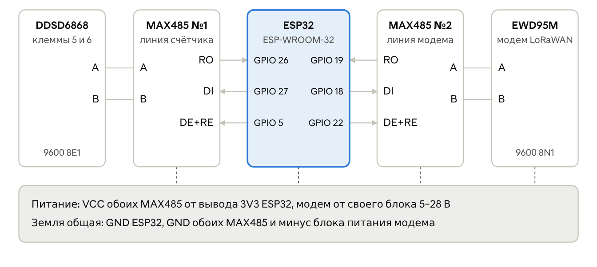

# Канал LoRaWAN: счётчик CHZSJ DDSD6868

ESP32 раз в 40 секунд читает счётчик по Modbus, складывает показания в пакет из 12 байт и отдаёт его модему Ebyte EWD95M. Модем передаёт пакет на шлюз, ChirpStack расшифровывает его, а мост на сервере перекладывает значения в платформу OpenEgiz.

<p align="center"></p>

| Линия | RO (приём) | DI (передача) | DE и RE вместе | Формат |
|---|---|---|---|---|
| Счётчик DDSD6868 | GPIO 26 | GPIO 27 | GPIO 5 | 9600 бод, 8E1 |
| Модем EWD95M | GPIO 19 | GPIO 18 | GPIO 22 | 9600 бод, 8N1 |

У счётчика RS-485 выведен на клеммы 6 (A) и 5 (B). VCC обоих MAX485 — от вывода 3V3 ESP32, модем питается от своего блока 5–28 В, земля у всех общая. GPIO 23 и 25 не используй: на первой плате они сгорели.

## Что в папке

| Файл | Назначение |
|---|---|
| [`firmware/esp32-meter-lorawan-v7/`](firmware/esp32-meter-lorawan-v7) | Прошивка ESP32: опрос счётчика, поиск модема, формирование и отправка пакета |
| [`chirpstack/chirpstack_decoder_ddsd6868.js`](chirpstack/chirpstack_decoder_ddsd6868.js) | Декодер пакета для профиля устройства в ChirpStack |
| [`bridge/chirpstack_to_opentwins.py`](bridge/chirpstack_to_opentwins.py) | Мост MQTT ChirpStack → MQTT OpenEgiz |
| [`bridge/opentwins-bridge.service`](bridge/opentwins-bridge.service) | Служба systemd для моста |
| [`tools/ddsd6868_scan.py`](tools/ddsd6868_scan.py) | Поиск скорости, адреса и регистров счётчика через переходник USB-RS485 |

## 1. Прошивка ESP32

1. Arduino IDE 2, пакет плат **esp32** от Espressif, плата **ESP32 Dev Module**.
2. Открой `firmware/esp32-meter-lorawan-v7/esp32-meter-lorawan-v7.ino` и загрузи.
3. Монитор порта на 115200. Рабочий журнал выглядит так:

```text
>>> MODUL NAYDEN na vyvodah 19/18/22
[<] 5:EU868
[*] +EVT:JOINED
U=213.5 V  I=0.00 A  P=0 W  PF=1.000  F=50.00 Hz  E=0.54 kWh
[>] AT+SEND=2:1:0:010857000000006400000036
[<] OK ... +SENT:01
```

Прошивка сама ищет модем на четырёх наборах выводов, так что при переносе линии на другие ножки её менять не нужно. Период передачи задаётся константой `SEND_MS`; в EU868 устройство может занимать эфир не больше 1 % времени, поэтому меньше 40 секунд не ставь.

## 2. Регистрация в ChirpStack

1. Профиль устройства: регион EU868, класс A, подключение OTAA.
2. Вкладка **Codec** профиля: вставь содержимое `chirpstack/chirpstack_decoder_ddsd6868.js`.
3. Устройство в приложении: DevEUI читается с модема командой `AT+CDEVEUI=?` (у нашего `0080E115053FE291`), JoinEUI — нули, AppKey совпадает с записанным в модем.

Ключи и регион хранятся в памяти модема, поэтому после замены ESP32 перерегистрировать ничего не нужно.

Формат пакета (12 байт, старший байт первым):

| Байты | Содержание | Пересчёт |
|---|---|---|
| 0 | Версия формата, 0x01 | — |
| 1–2 | Напряжение | × 0,1 В |
| 3–4 | Ток | × 0,01 А |
| 5–6 | Активная мощность | Вт |
| 7 | Коэффициент мощности | × 0,01 |
| 8–11 | Активная энергия | × 0,01 кВт·ч |

## 3. Мост в платформу

Мост должен видеть обе сети: ChirpStack (192.168.8.x) и OpenEgiz (192.168.0.x). У нас он работает на сервере платформы.

```bash
sudo mkdir -p /opt/opentwins-bridge
sudo cp bridge/chirpstack_to_opentwins.py /opt/opentwins-bridge/
sudo pip3 install -r bridge/requirements.txt        # или: sudo apt install python3-paho-mqtt
python3 /opt/opentwins-bridge/chirpstack_to_opentwins.py --dry-run   # проверка без публикации

sudo cp bridge/opentwins-bridge.service /etc/systemd/system/
sudo sed -i "s/^User=pi/User=$USER/" /etc/systemd/system/opentwins-bridge.service
sudo systemctl daemon-reload
sudo systemctl enable --now opentwins-bridge
journalctl -u opentwins-bridge -f
```

Адреса брокеров задаются ключами `--chirpstack` и `--opentwins` или переменными окружения `CHIRPSTACK_MQTT` и `OPENTWINS_MQTT`. Чтобы подключить ещё один модем, добавь строку в словарь `DEVICES`: DevEUI модема и идентификатор двойника.

## 4. Проверка

```bash
mosquitto_sub -h 192.168.8.122 -p 1883 -t 'application/+/device/+/event/up' -v   # пакеты в ChirpStack
mosquitto_sub -h 192.168.0.199 -p 30511 -t 'opentwins/#' -v                      # сообщения и события двойника
```
