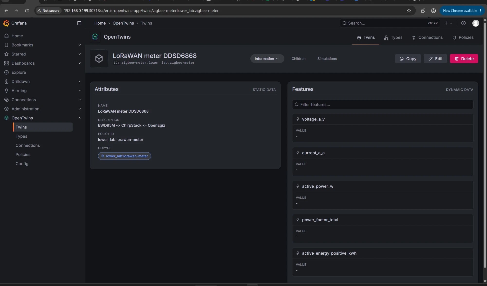

# Платформа OpenEgiz: дашборды и двойники

Платформа OpenEgiz построена на [OpenTwins](https://github.com/ertis-research/OpenTwins) с [Eclipse Ditto](https://eclipse.dev/ditto/) в основе. Данные проходят так:

```text
MQTT opentwins/<ns>:<name> → Eclipse Ditto (двойник) → Telegraf → InfluxDB (bucket default, измерение esp_telemetry, тег thingId) → Grafana
```

## Цифровой двойник

Двойник нужно создать **до** того, как устройство начнёт слать данные, иначе платформа молча выбросит сообщения.

Проще всего в интерфейсе: Grafana → OpenTwins → Twins → открыть работающий двойник → **Copy** → Namespace `lower_lab`, ID `<имя>`, Policy `lower_lab:lorawan-meter`, поменять Name и Description. Под названием должно получиться `ID: lower_lab:<имя>`.

<p align="center"></p>

На снимке ошибка: ID получился `zigbee-meter:lower_lab:zigbee-meter`, потому что в поле Namespace попало имя.

Тот же двойник можно создать через API Ditto по шаблону [`ditto/thing-template.json`](ditto/thing-template.json):

```bash
curl -u <логин>:<пароль> -X PUT -H "Content-Type: application/json" \
     -d @ditto/thing-template.json \
     "http://192.168.0.199:30525/api/2/things/lower_lab:<имя>"
```

Перед отправкой впиши в шаблон `thingId`, название и описание.

## Дашборды Grafana

| Файл | Дашборд |
|---|---|
| [`grafana/ddsd6868-lorawan.json`](grafana/ddsd6868-lorawan.json) | Счётчик DDSD6868 по LoRaWAN, 9 панелей |
| [`grafana/saiman-zigbee.json`](grafana/saiman-zigbee.json) | Счётчик Saiman по Zigbee, 12 панелей |

Импорт: Grafana → Dashboards → New → Import → загрузить JSON. Или через API:

```bash
jq '{dashboard: ., overwrite: true}' grafana/ddsd6868-lorawan.json | \
  curl -u <логин>:<пароль> -X POST -H "Content-Type: application/json" \
       -d @- http://192.168.0.199:30718/api/dashboards/db
```

Дашборды ссылаются на источник данных InfluxDB с UID `P4528D75AB74BE2EA`. На другой платформе выбери свой источник при импорте.
